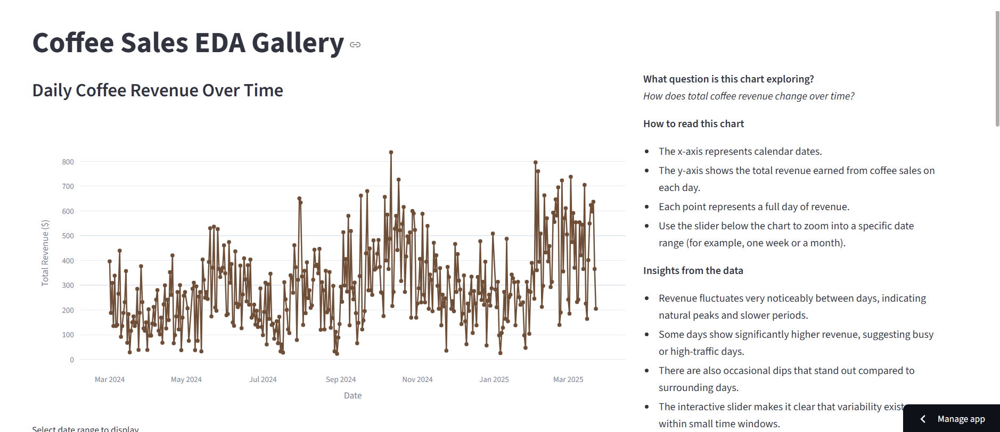
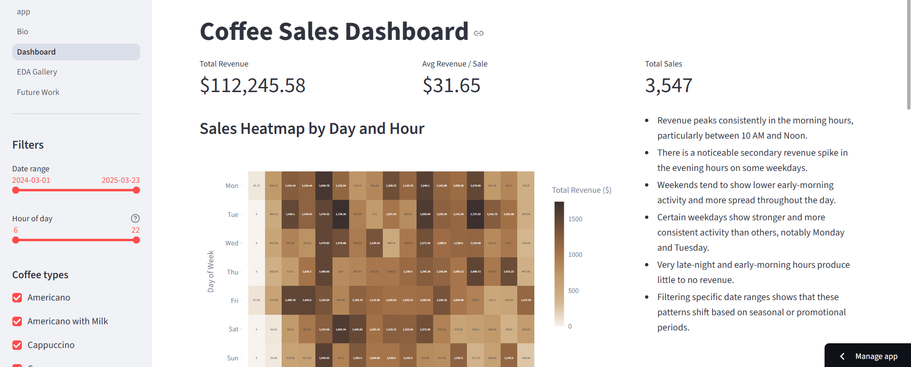

# Coffee Sales Analytics Dashboard & EDA Gallery

A multi-page interactive Streamlit application that explores retail coffee sales data through visual analytics.  
The app enables users to analyze patterns in revenue by time of day, weekday, month, and coffee type, and provides filtering controls to explore insights dynamically.

## Author

**Kevin Kruzel**  
Undergraduate Mathematics Student – MSU Denver  
Email: kkruzel1@msudenver.edu

## App Navigation Overview

The app consists of several pages:
**Professional Bio:** Short background, skill highlights, and visualization philosophy.
**EDA Gallery:** Exploratory analysis visualizations with explanations and insights.

**Dashboard:** Interactive filtering (date, hour, and coffee type) powering dynamic revenue & sales KPIs and charts.

**Future Work:** Planned improvements and reflection on prototype-to-product development.

## Dataset Information

- **Dataset:** Coffee Sales Dataset  
- **Source:** https://www.kaggle.com/datasets/kainatjamil12/coffe-sale/data
- **Rows:** 3,547 transactions
- **Columns include:** Date, hour_of_day, Weekday, Month, money (revenue), coffee_name, and additional categorical fields.
- **Preprocessing:** Converted `Date` column to datetime format.

### Ethics Note

This dataset contains transactional sales records only and does not include any personal customer information.  
No individual identities or sensitive personal attributes are present.

## Requirements

Dependencies are listed in `requirements.txt`

## AI Assitance Acknowledgment
- Portions of code structure (mostly regarding visualizations and more technical details) were assisted by ChatGPT.
- All implementation and creative decisions and final code were reviewed and customized by the Kevin Kruzel.

